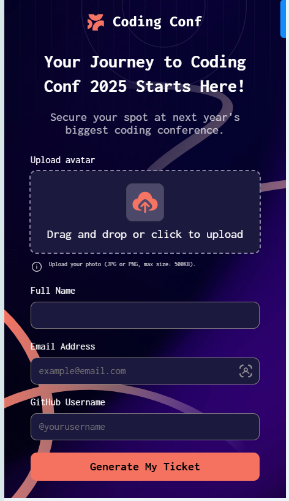

# Frontend Mentor - Conference ticket generator solution

This is a solution to the [Conference ticket generator challenge on Frontend Mentor](https://www.frontendmentor.io/challenges/conference-ticket-generator-oq5gFIU12w).

### The challenge

Users should be able to:

- Complete the form with their details
- Receive form validation messages if:
  - Any field is missed
  - The email address is not formatted correctly
  - The avatar upload is too big or the wrong image format
- Complete the form only using their keyboard
- Have inputs, form field hints, and error messages announced on their screen reader
- See the generated conference ticket when they successfully submit the form
- View the optimal layout for the interface depending on their device's screen size
- See hover and focus states for all interactive elements on the page

### Screenshot

### Links

- Solution URL: [Add solution URL here](https://github.com/samuel-faith/conference-ticket-generator-main)
- Live Site URL: [Add live site URL here](https://samuel-faith.github.io/conference-ticket-generator-main/)

### Built with

- Semantic HTML5 markup
- CSS custom properties
- Flexbox
- CSS Grid
- Mobile-first workflow

### What I learned

Data handling and reusing with JavaScript

# Conference Ticket Generator

A web application for generating conference tickets. Users can upload their avatar, enter their details, and generate a personalized ticket for the Coding Conf 2025 event.

---

## Table of Contents
- [Features](#features)
- [Technologies Used](#technologies-used)
- [Usage](#usage)
- [Screenshots](#screenshots)
- [License](#license)
- [Acknowledgements](#acknowledgements)

---

## Features
- **User-Friendly Form**: Users can input their full name, email, and GitHub username.
- **Avatar Upload**: Users can upload an avatar image (JPG or PNG, max size: 500KB).
- **Ticket Generation**: Generates a personalized ticket with user details and avatar.
- **Responsive Design**: Works seamlessly on desktop, tablet, and mobile devices.
- **Validation**: Ensures all fields are filled and the uploaded file meets requirements.

---

## Technologies Used
- **Frontend**:
  - HTML5
  - CSS3 (Flexbox, Grid)
  - JavaScript (Vanilla JS)
- **Tools**:
  - Google Fonts ([Inconsolata](https://fonts.google.com/specimen/Inconsolata))
  - SVG Backgrounds and Icons
- **Version Control**:
  - Git
  - GitHub

**Usage**
Fill Out the Form:

Enter your full name, email, and GitHub username.

Upload an avatar image (JPG or PNG, max size: 500KB).

Generate Your Ticket:

Click the "Generate My Ticket" button.

Your personalized ticket will be displayed.

View Your Ticket:

The ticket includes your name, email, GitHub username, and avatar.

**Screenshots**
Desktop View

Mobile View

**Acknowledgements**
Fonts: Google Fonts

Icons: Iconmonstr

Inspiration: Frontend Mentor

Author
Adelaja Samuel

GitHub: @samuel-faith

Twitter: @samuel_delaja

LinkedIn: https://www.linkedin.com/in/adelajasamuel1